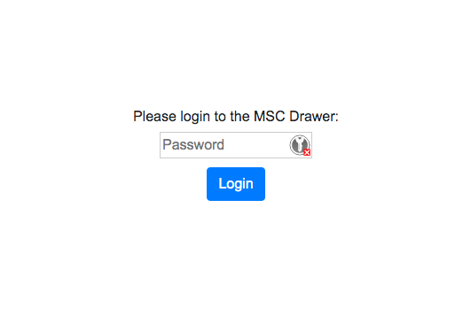
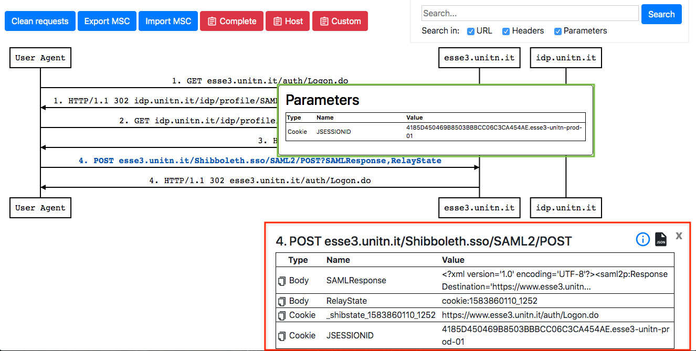
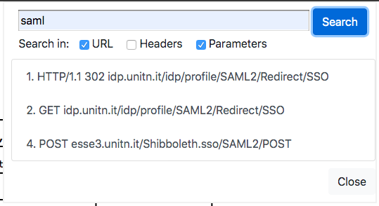

# MSC Drawer

This webapp is meant to display the sequence of messages exchanged between different entities. It provides a visual representation of the messages allowing also the user to inspect URL, headers, parameters and body of each message.

When you load it, a login page is displayed. Since MSC Drawer support different sessions, this login page allow the user to choose his session. The password the user has to insert is the *Scenario name* inserted in the dashboard during the configuration.

After the login, as soon the you perform the authentication on the System Under Test, the generated message sequence chart is displayed. The hover on a message will show a brief overview about the message content (green rectangle in the picture below) while the click on it will show more details (red rectangle in the picture below).

On the left corner of the message sequence chart, there are three blue button providing the following features:
- **Clean request**: this button is used to delete all the messages in the MSC.
- **Export MSC**: this button is used to export the MSC as a JSON file.
- **Import MSC**: this button is used to import a MSC from a JSON file.

On the right corner there is also a search box where the user can type a string and look for it in the MSC. The user can choose the granularity of the research using the checkboxes under the input textbox.

