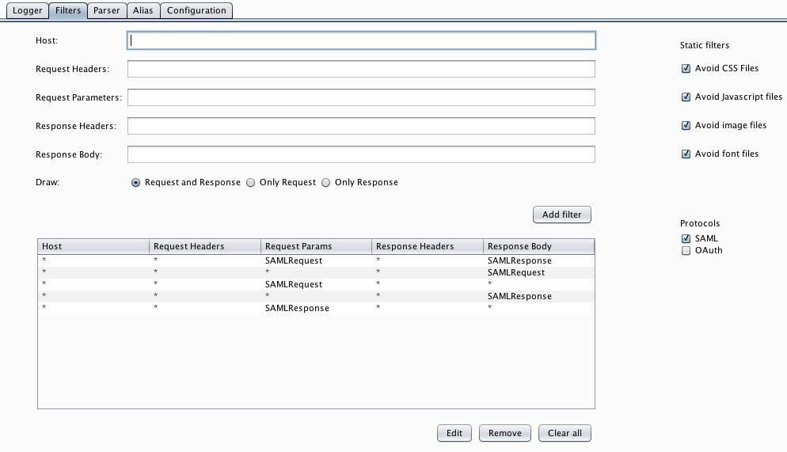
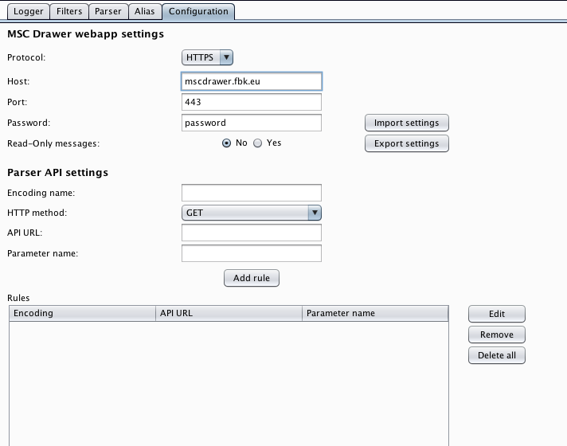
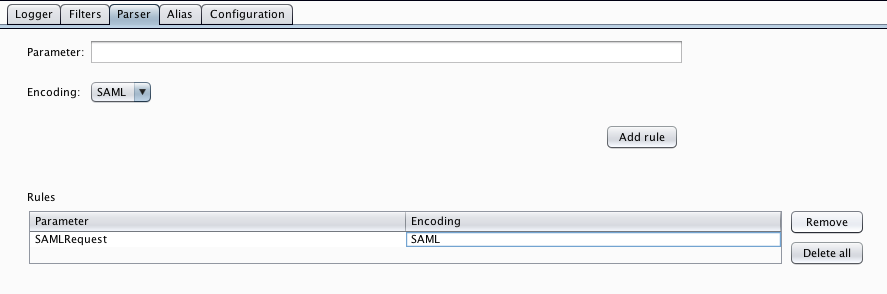
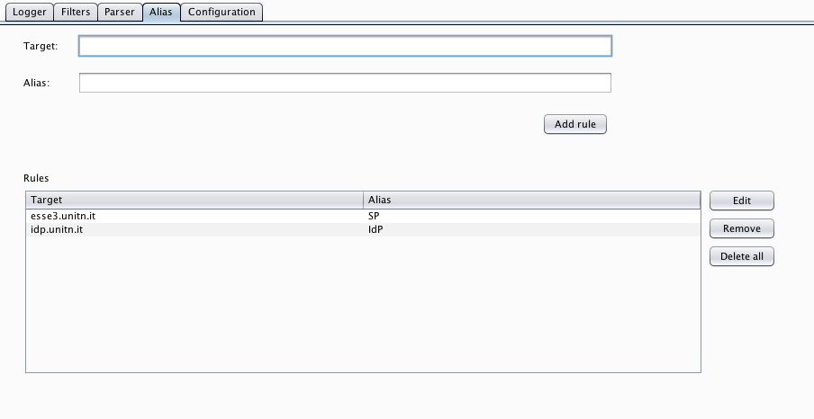
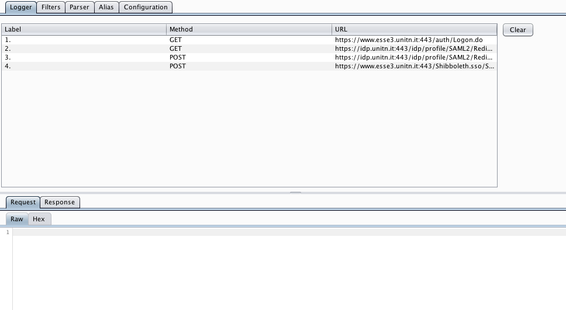

# MSC Logger Plugin
**MSC Logger Plugin** is a Burp extension meant to analyze the traffic and display on the MSC webapp the flow of messages the user is interested in.

## Filters

`Filters` tab is used to set up the filters to intercept only those messages the user is interested in.
*MSC Logger* extension follows a white-list approach intercepting only the messages that match the criteria the user have inserted. Therefore only after the definition of some filters the extension will start intercepting messages.

The `Host` field is used to white-list host names (i. e. by writing `google` all the request containing in the hostname `google` will be drawn). The other text fields apply the same approach to the indicated fields.

The user can also avoid to intercept messages concerning CSS, JS, images and font files, that could not be of his interest, by checking the related checkboxes on the right (enabled by default).

Here you will find the filters to incercept messages related to the protocol chosen in the dashboard during the configuration.

## Configuration

The `Configuration` tab is organized in two sections. The first one, **MSC Drawer webapp settings** is used to configure the *MSC Drawer* webapp where the information about the intercepted messages will be sent. Default settings point to the deployed instance of the *MSC Drawer* webapp previously configured through the dashboard.
The _Password_ field is intended as a session ID. All the requests logged under the same password are accessible from the *MSC Drawer* webapp using the chosen password. In MIG case it is the *Scenario name* inserted in the dashboard
The _Read-Only messages_ field is intended to make the intercepted messages persistent which means that a user can not delete them from the webapp. This feature has been thought as a way to share a message sequence chart without the risk of modification or deletion by the users accessing it. It is unuseful for the scope of MIG case.
The buttons *Import settings* and *Export settings* allow the user to respectively import a JSON files with customize settings or export the actual configuration to a JSON file.

The second part, **Parser API settings** is used to define the endpoints use by the `Parser` tab to decode some encoded parameters. To do so, in the configuration tab the user has to define:
- _Encoding name_: identifier used to recognize the encoding format (e.g. `base64`).
- _HTTP method_: HTTP method use to call the API endpoint.
- _API URL_: API service endpoint where the parameter will be decoded (e.g. `http://example.com/saml/decode`)
- _Parameter name_: name of the API service input parameter that will contain the value that has to be decoded.

All the encoding format defined here will be available on the parser tab for the mapping with the parameter chosen by the user.

_Note_: the API service the user is going to set up has to return back as response the decoded value and nothing else otherwise the logger will throw an error.

## Parser

The `Parser` tab allows the decoding of some of the intercepted parameters before they are sent to the _MSC Drawer_ webapp. By doing this, the search feature provided by the webapp can be fully exploited, also in the case that parts of the original message are in some way encoded.

For instance, assume MSC logger is intercepting SAML SSO flow. Intercepted SAMLRequest and SAMLResponse will be _base64_ encoded and maybe also deflated. Therefore, to obtain the plain value from those parameters, the user has to add a decoding service in the `Configuration` tab and specify in the `Parser` tab how they are encoded. The list of the available encoding format is retrieved from the items contained in the *Parser API settings* table of the `Configuration` tab. After the addition of the parsing service to that table, the user has to map the parameter that has to be decoded (i.e. SAMLRequest) to the encoding format that has to be used (i.e. SAML which means base64 and deflate) and the parser configuration will be completed.

## Alias

The `Alias` tab allows the definition of aliases to improve the clearity of the MSC that will be drawn. Here the user has the possibility to map an hostname to a custom alias.
For instance, assume MSC logger is intercepting SAML SSO flow. The entities involved in the communication are the user agent, a service provider and an identity provider. Using the feature provided by this tab, the user has the possibility to rename the service provider hostname (`esse3.unitn.it` in the picture) with a custom name he decides (`SP` in the picture above).

## Logger

After the configuration of the other tabs, the user can start intercepting the flow. The `Logger` tab will show all the intercepted messages that satisfied the inserted filters. These messages are the same displayed in the _MSC Drawer_ webapp.
