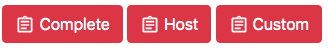
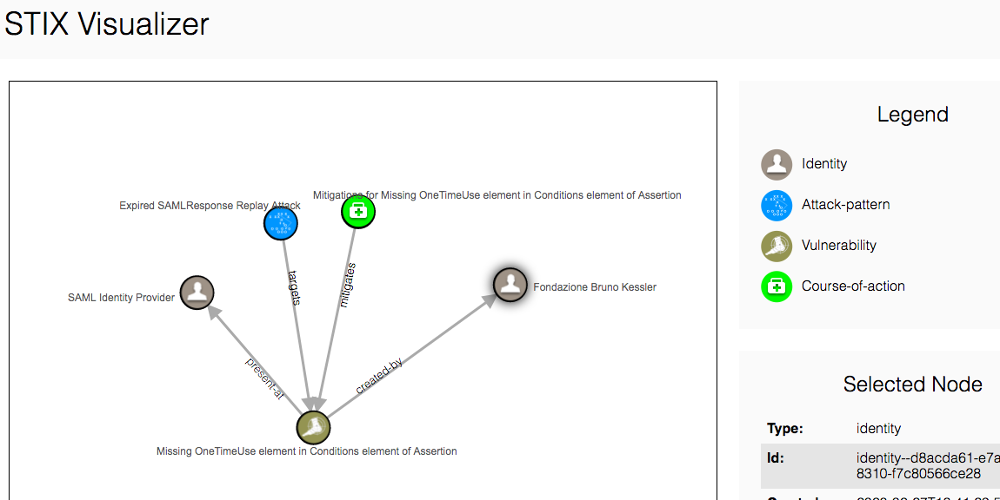

# STIX Visualizer

This webapp provides a service that looks for Cyber Threat Intelligence (CTI) information related to the intercepted flow and graphically displays them in the webapp. This information is retrieved from a database of [STIX](https://oasis-open.github.io/cti-documentation/) notes.

Three red buttons (`Complete`, `Host`, `Custom`) provide the possibility to choose which kind of CTI the user will look for. `Complete` button will return STIX notes related to the whole flow displayed, `Host` will return CTI information about the messages exchanged with a specific host while `Custom` will allow the user to look for some string he desires.

An example of the resulting graph is reported below.

